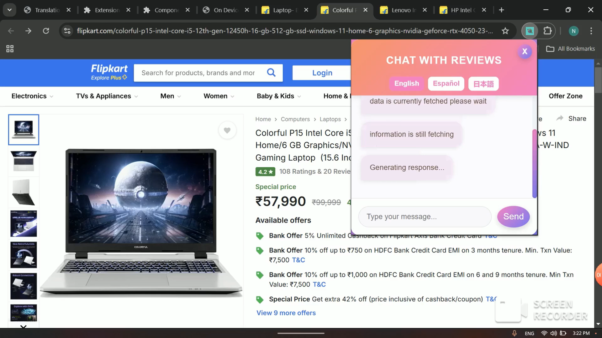

#  Review-Lens
Don't spend hours reading reviews instead use this extension. Built this with Google's Prompt API ,Translator API and universal-sentence-encoder from tensorflow.js

[Watch the Demo ](https://www.youtube.com/watch?v=r6EG5Z9dVsc&ab_channel=Nanthakumar)





## Installation
```sh

1.Install Gemini Nano and enable translation api and download spanish-englishandjapanese-english pair.
2.clone the repo and goto chrome://extensions in google enable developers mode.Click load unpacked chose this extension and click submit.  
3.Goto a product page of Flipkart or Amazon where you can see a products details,price,option to buy.
4.click on the extension Icon and try it  


```
